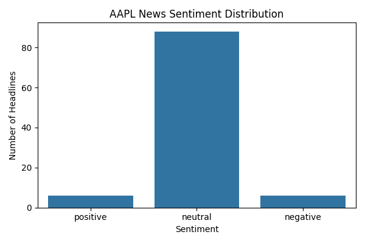
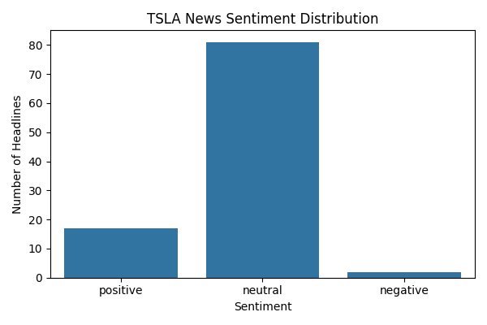
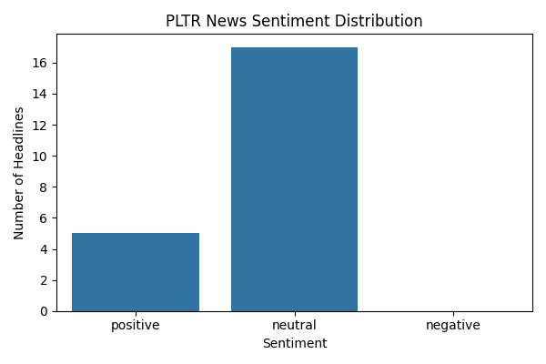

# 🧠 Financial News Sentiment Analyzer

This project builds a robust pipeline for analyzing sentiment in financial news headlines using a custom LSTM model and a fine-tuned version of FinBERT — a BERT-based language model trained on financial text. The system helps predict whether a headline expresses **positive**, **neutral**, or **negative** sentiment, and visualizes the sentiment trends for any company.

---

## 📌 Features

- 🔍 **Fetches real financial news headlines** using the NewsAPI
- 🧠 **Custom LSTM model** trained on the Financial PhraseBank dataset
- 💼 **Fine-tuned FinBERT model** for domain-specific sentiment accuracy
- 📊 **Sentiment analysis + visualization** for tech companies in the SNP 500
---

## ⚙️ Requirements

Install all required packages using:

```bash
pip install -r requirements.txt
```
## 📈 Example Results

### Sentiment Distribution for Apple



### Sentiment Distribution for Tesla



### Sentiment Distribution for Palantir



